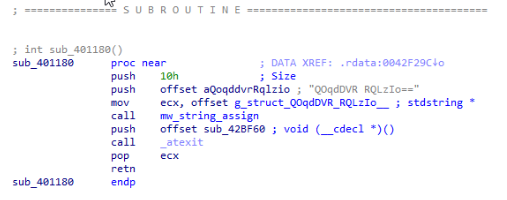
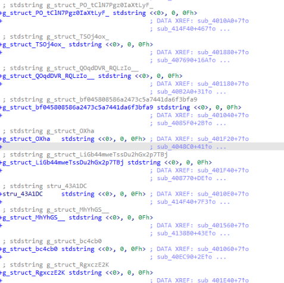

# amadey-string-renamer
 Ida python script to rename Amadey's stdstrings structs to the string assigned to them.
 
 This script is based on the following pattern of string assignment:
 

 
 There's a `push` of the string size value and of the offset to the string itself, while the `stdstring` struct offset is passed via the `ECX` register. This script renames that offset to the string passed via `push`.
 
 It will ignore instances where there is a size of zero or where the call to `mw_string_assign` does not follow the pattern shown in the image above. After running the script you will have a result similar to this:
 

# Usage

To run the script, load the file into Ida and press `Shift + Y`. You'll be prompted for the address of the string assignment function (format is hex - `0x?????`). There is a simple check of the amount of xrefs to the address you supplied that will warn you if the number is too low. However, *it's up to you to provide the correct address for `mw_string_assign`*.

# Acknowledgements

With thanks to [OALabs](https://www.openanalysis.net/) and [herrcore](https://twitter.com/herrcore) for their stream and notes on Amadey. Notes are [here](https://research.openanalysis.net/cpp/stl/amadey/loader/config/2022/11/13/amadey.html), for the stream VOD go sub to their [patreon](https://www.patreon.com/oalabs).